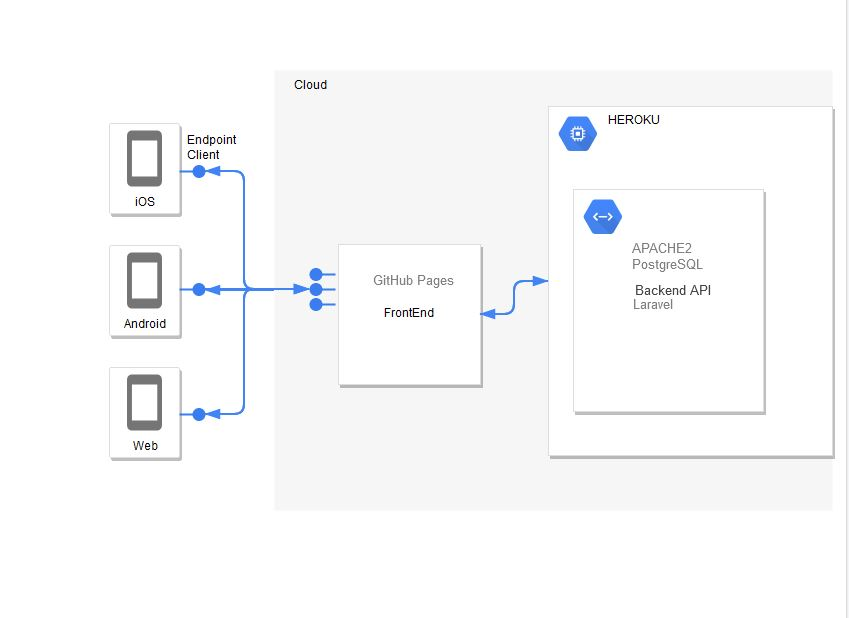

<h1 align="center">Real time weather</h1>

<div align="center">
  :sunny:
</div>
<div align="center">
  <strong>Minimal backend provided by Laravel API hosted in https://apilaravel.herokuapp.com/ </strong>
  <br /> 
 <a href="https://openweathermap.org"><strong>Based on openweathermap API<Strong> </a>
</div>
<br />
<div align="center">
  <h3>
    <a href="https://bebcampa.github.io/weathernow/">
      APP DEMO
    </a>
</div>
<div align="center">
  <h1>
  Architecture
  </h1>
</div>


## Project setup
```
npm install
```

### Compiles and hot-reloads for development
```
npm run serve
```

### Compiles and minifies for production
```
npm run build
```

### Lints and fixes files
```
npm run lint
```

### Customize configuration
See [Configuration Reference](https://cli.vuejs.org/config/).
